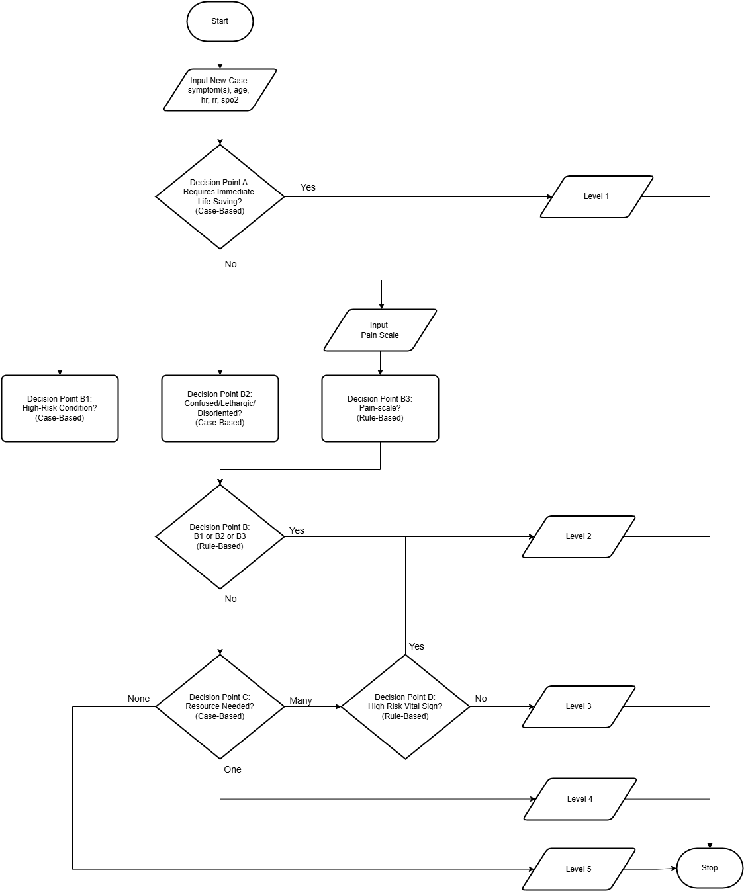

# IF4070-KBS-Triage-System
IF4070 Representasi Pengetahuan dan Penalaran<br><br>

## Sistem Triase Berbasis Knowledge-Based System
Sistem triase berbasis **knowledge-based system** dirancang untuk membantu menentukan tingkat prioritas penanganan pasien di Instalasi Gawat Darurat (UGD). Sistem ini mengacu pada **Emergency Severity Index (ESI)** dan **Standar Kompetensi Dokter Indonesia (SKDI)** untuk mengelompokkan pasien berdasarkan tingkat keparahan kondisi medis serta kebutuhan sumber daya medis.

---

## Daftar Isi

1. [Deskripsi Sistem](#deskripsi-sistem)
2. [Fitur Utama](#fitur-utama)
3. [Cara Menjalankan Program](#cara-menjalankan-program)
4. [Rancangan Arsitektur Sistem](#rancangan-arsitektur-sistem)
5. [Struktur Program](#struktur-program)
6. [Contoh Kasus](#contoh-kasus)
7. [Kontributor](#kontributor)

---

## Deskripsi Sistem

Sistem Triage berbasis knowledge-based system ini dirancang untuk membantu tenaga medis menentukan tingkat prioritas penanganan pasien di unit gawat darurat (UGD) sesuai dengan Emergency Severity Index (ESI). Sistem ini mengacu pada Standar Kompetensi Dokter Indonesia (SKDI) untuk mendukung analisis gejala yang lebih luas dan akurat.

Dengan memanfaatkan Simple Classification dan Case-Comparing Classification, sistem ini mengolah data pasien, seperti gejala, usia, heart rate (HR), respiratory rate (RR), dan saturasi oksigen (SpO2) untuk menghasilkan level triase yang menggambarkan tingkat urgensi penanganan.

Sistem ini diimplementasikan menggunakan CLIPS (C Language Integrated Production System), sebuah platform rule-based reasoning yang dirancang untuk memproses kumpulan aturan dengan efisien.

---

## Fitur Utama
1. **Basis Pengetahuan:**
   - Sistem menggunakan kombinasi **simple classification** berbasis rule dan **case-comparing classification** untuk mengevaluasi kasus pasien.
   - Input mencakup gejala klinis, usia pasien, heart rate (HR), respiratory rate (RR), dan SpO2.
   - Output berupa level triase pasien sesuai dengan lima tingkat ESI.

2. **Klasifikasi:**
   - **Simple Classification**: Menggunakan aturan berbasis logika untuk menangani kasus sederhana.
   - **Case-Comparing Classification**: Membandingkan kasus baru dengan kasus yang telah diketahui untuk menemukan kecocokan berdasarkan kemiripan fitur.

---
## Rancangan Arsitektur Sistem
Berikut adalah diagram rancangan arsitektur sistem triase Emergency Severity Index (ESI) berbasis Knowledge-Based System (KBS): <br>


---
## Struktur Program
```plaintext
IF4070-KBS-Triage-System
|   README.md
|   
+---data
|       Decision Knowledges.xlsx
|       
+---docs
|       Emergency_Severity_Index_Handbook.pdf
|       IF4070-KBS-Triage.drawio.png
|       LAPORAN-Kelompok 7-RPP KBS-Triage System.pdf
|       PPT-Kelompok 7-RPP KBS-Triage System.pdf
|       SKDI_Perkonsil_11_maret_131.pdf
|       
\---src
    |   main.CLP
    |   
    +---facts
    |       deffacts-cases-a.CLP
    |       deffacts-cases-b1.CLP
    |       deffacts-cases-b2.CLP
    |       deffacts-cases-c.CLP
    |       
    \---rule
            rule-vital-signs.CLP
            severe-pain.CLP
```
---
## Cara Menjalankan Program

### Persiapan
- Pastikan Anda telah menginstal:
  - **Git** untuk mengunduh repository.
  - **CLIPS IDE** untuk menjalankan program.

### Langkah-Langkah
1. **Clone Repository:**
   - Buka terminal atau command prompt, lalu jalankan:
     ```bash
     git clone https://github.com/munzayanahusn/IF4070-KBS-Triage-System.git
     ```

2. **Buka CLIPS IDE:**
   - Jalankan aplikasi **CLIPS IDE** di perangkat Anda.

3. **Muat File Construct:**
   - Pada menu **Environment**, pilih **Load Constructs...**.
   - Pilih file `.clp` dari repository yang telah di-clone.

4. **Clear Environment:**
   - Pastikan lingkungan CLIPS bersih dengan perintah:
     ```clips
     (clear)
     ```

5. **Muat File Utama Sistem Triase:**
   - Muat file utama dengan perintah:
     ```clips
     (load "main.clp")
     ```

6. **Reset Program:**
   - Lakukan inisialisasi dengan perintah:
     ```clips
     (reset)
     ```

7. **Input Kasus Baru:**
   - Masukkan data pasien sesuai format berikut:
     ```clips
     (assert (new-case (symptoms "penurunan kesadaran" "henti napas" "suara serak") (age 45) (hr 100) (rr 10) (spo2 85)))
     ```

8. **Jalankan Sistem:**
   - Eksekusi program untuk memproses data pasien:
     ```clips
     (run)
     ```

9. **Ikuti Instruksi:**
   - Sistem akan memberikan instruksi tambahan jika diperlukan. Masukkan data sesuai permintaan sistem.

10. **Final Decision:**
    - Sistem akan menghasilkan *Final Decision* berupa level triase pasien. Hasil ini dapat digunakan untuk mendukung prioritas penanganan.

---
## Contoh Kasus
Input:
```clips
(assert (new-case (symptoms "penurunan kesadaran" "henti napas" "suara serak") (age 45) (hr 100) (rr 10) (spo2 85)))
```
Output:
```
Decision system initialized.
Input validated successfully.
Best Matched Case: A-4 with 2 symptoms. Label: true
Final Decision: Level-1
```

## Kontributor

| **Nama**                  | **NIM**     |
|---------------------------|-------------|
| Syarifa Dwi Purnamasari   | 13521018    |
| Husnia Munzayana          | 13521077    |
| Asyifa Nurul Shafira      | 13521125    |
